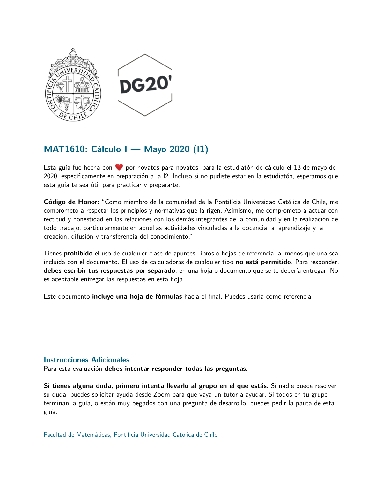
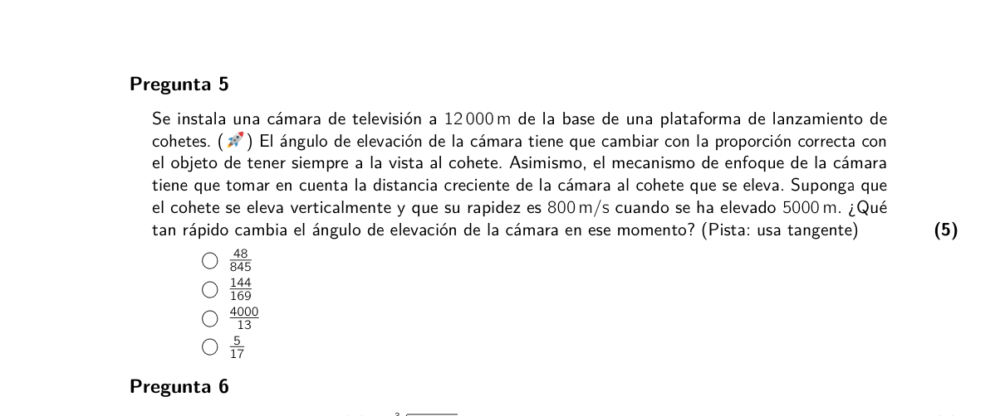

# Plantilla Dinámica UC

La idea de este proyecto es proveer **una plantilla atractiva, moderna y dinámica para distintas clases de evaluaciones y guías de trabajo dentro de la UC.**

Esta plantilla es una derivación directa de la plantilla existente y públicamente liberada de la Escuela de Ingeniería de la Universidad de Edinburgh. Puedes ver mas información de la licencia pertinente en [LICENSE.md](LICENSE.md).

La plantilla se encuentra escrita en LaTeX, y fue adaptado para su uso en LuaTeX en su versión de desarrollo (necesario para el soporte de emojis a través de Harfbuzz).

Este proyecto no tiene ninguna afiliación de carácter oficial con la Universidad Católica.

## Uso

Para usar la plantilla, debes modificar los dos archivos base, `documento.tex` y `formulas.tex` (opcional), al igual que los archivos de preguntas, que se encuentran ubicados en `preguntas/`.

<pre>
├── LICENSE.md // licencia
├── README.md // este documento
├── README_original.txt // guía original (en inglés)
├── base.tex // documento auxiliar principal
├── documento.tex // documento principal
├── portada.tex // portada del documento
├── formulas.tex // hoja de fórmulas (cheat sheet, opcional)
├── emoji.ttf // tipografía para emojis (Noto Color Emoji)
├── coloremoji.sty // archivo auxiliar para emojis
├── imagenes/
│   ├── delegados2020.png
│   └── puc_comunitario.png
├── preguntas/
│   ├── alternativas.tex
│   ├── catorce.tex // preguntas de ejemplo
│   ├── doce.tex
│   └── trece.tex
└── latexmkrc // config. de lualatex para Overleaf
</pre>

En los archivos base, podrás configurar características del documento según tus necesidades, como:

- Código del Curso y Título
- Fecha del Documento
- Presencia de respuestas (genera rúbricas automáticamente)
- Número de preguntas que hay que responder
- Si se puede utilizar calculadora
- Si se incluye una hoja de fórmulas
- Si la prueba es con libro abierto

Para compilar el documento, es importante usar LuaTeX (no PDFLaTeX o XeTeX), dentro de lo posible en su versión de desarrollo (luatex-dev).

## Cosas por Hacer

- Traducir Comandos
- Hacer que la puntación sean desactivables
- Configurar texto para calculadora, fórmulas y libro abierto
- Añadir soporte para subunidades académicas específicas
- Hacer que el logo sea configurable
- Corregir hbox
- Mejorar preguntas prototípicas
- Guía de uso detallada
